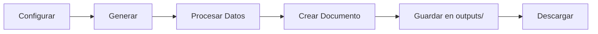
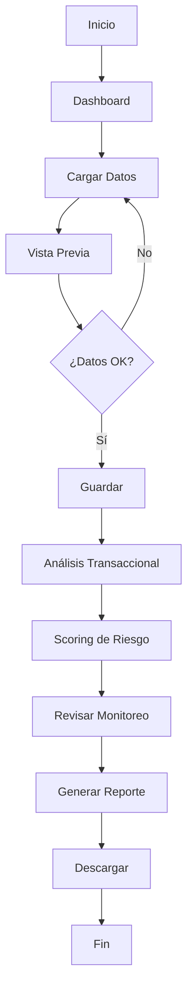

# 📖 Funcionamiento del Sistema AdamoPay - Análisis Transaccional

## 🌟 Descripción General

El Sistema de Análisis y Reporte Transaccional de AdamoPay es una aplicación web interactiva construida con **Streamlit** que permite analizar, monitorear y generar reportes de transacciones financieras con enfoque en detección de riesgos.

---

## 🚀 Cómo Iniciar la Aplicación

### Requisitos Previos
- Python 3.8 o superior instalado
- Dependencias instaladas (`requirements.txt`)

### Ejecutar la Aplicación

```bash
cd "AdamoPay_Analisis_ReporteTX"
python -m streamlit run app.py
```

**La aplicación estará disponible en:**
- 🌐 Local: `http://localhost:8501`
- 🌐 Red: `http://192.168.0.182:8501`

---

## 🎯 Funcionalidades Principales

### 1. 📊 Dashboard Principal

El dashboard proporciona una vista general del sistema con métricas clave:

#### Métricas Visualizadas:
- **Total Transacciones**: Contador de todas las transacciones procesadas
- **Transacciones de Alto Riesgo**: Número de transacciones marcadas como riesgosas
- **Monto Total**: Suma total de todas las transacciones
- **Alertas Activas**: Número de alertas que requieren atención

#### Gráficos:
- 📈 **Transacciones por Día**: Visualización temporal de la actividad
- ⚠️ **Distribución de Riesgo**: Gráfico de categorización de riesgo

> **Nota**: Los gráficos se activarán cuando se carguen datos reales

---

### 2. 📁 Cargar Datos

Esta sección permite importar datos de transacciones desde archivos externos.

#### Formatos Soportados:
- ✅ CSV (`.csv`)
- ✅ Excel (`.xlsx`, `.xls`)

#### Proceso de Carga:

1. **Seleccionar Archivo**: Usar el botón de carga para seleccionar el archivo
2. **Validación Automática**: El sistema lee y valida la estructura
3. **Vista Previa**: Se muestran los primeros 10 registros
4. **Información Mostrada**:
   - Nombre del archivo
   - Total de registros
   - Columnas disponibles
   - Vista previa de datos

5. **Guardar Datos**: Botón para almacenar permanentemente en `data/raw/`

#### Manejo de Errores:
- El sistema detecta y reporta errores de formato
- Mensajes claros de error para facilitar correcciones

**Ejemplo de uso:**
```python
# Estructura esperada del archivo CSV/Excel:
fecha, monto, usuario_id, comercio, estado
2025-01-15, 1500.00, USR001, Tienda ABC, aprobado
```

---

### 3. 🔍 Análisis Transaccional

Módulo para análisis profundo de las transacciones cargadas.

#### Tipos de Análisis Disponibles:

1. **Análisis de Montos**
   - Estadísticas descriptivas (media, mediana, desviación)
   - Detección de montos atípicos
   - Distribución de montos

2. **Análisis de Frecuencia**
   - Transacciones por período
   - Patrones de actividad
   - Picos de actividad

3. **Análisis de Patrones**
   - Comportamientos recurrentes
   - Secuencias de transacciones
   - Correlaciones entre variables

4. **Detección de Anomalías**
   - Identificación de comportamientos inusuales
   - Alertas automáticas
   - Scoring de anomalías

#### Configuración:
- **Rango de Fechas**: Seleccionar período a analizar
- **Filtros Múltiples**: Combinar varios tipos de análisis
- **Ejecución en Tiempo Real**: Resultados instantáneos

---

### 4. ⚠️ Scoring de Riesgo

Sistema de categorización de riesgo basado en umbrales configurables.

#### Categorías de Riesgo:

| Categoría | Umbral | Indicador |
|-----------|--------|-----------|
| 🟢 **Bajo** | < 0.3 | Transacción normal |
| 🟡 **Medio** | 0.3 - 0.6 | Requiere revisión |
| 🔴 **Alto** | > 0.6 | Requiere acción inmediata |

#### Configuración de Umbrales:

La interfaz permite ajustar dinámicamente los umbrales:

```python
# Configuración actual (config/settings.py)
RISK_THRESHOLDS = {
    "bajo": 0.3,
    "medio": 0.6,
    "alto": 1.0
}
```

#### Factores de Scoring:
El scoring considera múltiples variables:
- Monto de la transacción
- Frecuencia de transacciones del usuario
- Horario de la transacción
- Ubicación geográfica
- Historial del usuario
- Tipo de comercio

#### Visualización:
- Métricas de cada categoría
- Ajuste interactivo con sliders
- Guardado de configuración personalizada

---

### 5. 🔔 Monitoreo

Sistema de monitoreo en tiempo real con reglas predefinidas.

#### Reglas de Monitoreo Activas:

1. **Monto Inusual**
   - Detecta transacciones con montos fuera del patrón normal
   - Estado: Activa
   
2. **Frecuencia Alta**
   - Identifica usuarios con actividad anormalmente alta
   - Estado: Activa
   
3. **Horario Inusual**
   - Marca transacciones en horarios atípicos
   - Estado: Activa
   
4. **Ubicación Sospechosa**
   - Detecta transacciones desde ubicaciones inusuales
   - Estado: Configurable

#### Panel de Alertas:
- Lista de alertas recientes
- Estado de cada regla
- Contador de alertas por regla
- Activación/desactivación de reglas

#### Tabla de Reglas:
```
| Nombre             | Estado   | Alertas |
|--------------------|----------|---------|
| Monto inusual      | Activa   | 0       |
| Frecuencia alta    | Activa   | 0       |
| Horario inusual    | Activa   | 0       |
| Ubicación sospecha | Inactiva | 0       |
```

---

### 6. 📄 Generar Reportes

Sistema completo de generación de reportes personalizables.

#### Tipos de Reportes:

1. **Reporte Completo**
   - Análisis integral de todas las transacciones
   - Incluye todas las secciones

2. **Reporte de Riesgo**
   - Enfocado en transacciones de riesgo medio/alto
   - Recomendaciones de mitigación

3. **Reporte de Alertas**
   - Detalle de alertas generadas
   - Acciones recomendadas

4. **Reporte Personalizado**
   - Selección manual de secciones
   - Configuración flexible

#### Formatos de Salida:

- 📕 **PDF**: Para presentaciones y archivo
- 📗 **Excel**: Para análisis adicional
- 📘 **HTML**: Para visualización web

#### Configuración del Reporte:

**Parámetros Configurables:**
- Rango de fechas
- Tipo de reporte
- Formato de salida
- Secciones a incluir:
  - ✅ Resumen ejecutivo
  - ✅ Gráficos
  - ✅ Tablas detalladas
  - ✅ Recomendaciones
  - ✅ Anexos

#### Proceso de Generación:



**Ubicación de reportes generados:**
```
outputs/reports/reporte_YYYYMMDD_HHMMSS.pdf
```

---

## 🏗️ Arquitectura del Sistema

### Estructura de Archivos:

```
AdamoPay_Analisis_ReporteTX/
│
├── app.py                    # ⭐ Aplicación principal Streamlit
├── AdamoPay_AnalisisReporteTX.py  # Script de consola
│
├── data/
│   ├── raw/                  # Datos originales cargados
│   └── processed/            # Datos procesados
│
├── src/
│   ├── analysis/             # Módulos de análisis
│   ├── risk/                 # Scoring de riesgo
│   ├── monitoring/           # Reglas de monitoreo
│   └── reports/              # Generación de reportes
│
├── templates/
│   └── report_templates/     # Plantillas de reportes
│
├── outputs/
│   └── reports/              # Reportes generados
│
└── config/
    └── settings.py           # Configuraciones del sistema
```

---

## 🔧 Tecnologías Utilizadas

### Framework Principal:
- **Streamlit 1.52+**: Framework de aplicación web
  - Interfaz reactiva e interactiva
  - Sin necesidad de HTML/CSS/JavaScript
  - Actualización automática

### Análisis de Datos:
- **Pandas 2.0+**: Manipulación de datos
- **NumPy 1.24+**: Cálculos numéricos

### Visualización:
- **Matplotlib 3.7+**: Gráficos estáticos
- **Seaborn 0.12+**: Visualizaciones estadísticas
- **Plotly 5.18+**: Gráficos interactivos

### Reportes:
- **ReportLab 4.0+**: Generación de PDFs
- **FPDF2 2.7+**: PDFs alternativos

### Utilidades:
- **Python-dateutil**: Manejo de fechas
- **Openpyxl**: Lectura/escritura de Excel

---

## 🎨 Interfaz de Usuario

### Panel Lateral (Sidebar):
- 🔧 **Panel de Control**
- Selector de módulos
- Información de fecha/hora en tiempo real

### Área Principal:
- Contenido dinámico según módulo seleccionado
- Layout adaptable (wide mode)
- Componentes interactivos

### Componentes UI Utilizados:

1. **Métricas** (`st.metric`)
   - Valores numéricos con deltas
   - Indicadores visuales

2. **Carga de Archivos** (`st.file_uploader`)
   - Drag & drop
   - Validación automática

3. **DataFrames** (`st.dataframe`)
   - Tablas interactivas
   - Ordenamiento y filtrado

4. **Selectores**
   - `st.selectbox`: Opción única
   - `st.multiselect`: Múltiples opciones
   - `st.radio`: Opciones excluyentes
   - `st.slider`: Valores numéricos

5. **Fechas** (`st.date_input`)
   - Calendario interactivo
   - Validación de rangos

6. **Botones** (`st.button`)
   - Acciones principales
   - Descargas

7. **Expandibles** (`st.expander`)
   - Secciones colapsables
   - Organización de contenido

---

## 📊 Flujo de Trabajo Típico

### Caso de Uso: Análisis Completo de Transacciones



### Pasos Detallados:

1. **Acceder al Dashboard** (vista inicial)
   - Ver estado general del sistema

2. **Cargar Datos**
   - Seleccionar archivo CSV/Excel
   - Validar estructura
   - Guardar en `data/raw/`

3. **Realizar Análisis**
   - Configurar parámetros
   - Ejecutar análisis
   - Revisar resultados

4. **Evaluar Riesgo**
   - Revisar scoring automático
   - Ajustar umbrales si necesario
   - Identificar transacciones de alto riesgo

5. **Monitorear Alertas**
   - Revisar reglas activas
   - Verificar alertas generadas
   - Tomar acciones necesarias

6. **Generar Reporte**
   - Configurar tipo y formato
   - Seleccionar período
   - Generar y descargar

---

## ⚙️ Configuración

### Archivo: `config/settings.py`

```python
# Rutas del sistema
DATA_RAW_PATH = "data/raw"
DATA_PROCESSED_PATH = "data/processed"
OUTPUTS_PATH = "outputs/reports"
TEMPLATES_PATH = "templates/report_templates"

# Umbrales de riesgo (configurables)
RISK_THRESHOLDS = {
    "bajo": 0.3,
    "medio": 0.6,
    "alto": 1.0
}

# Formato de reportes
REPORT_FORMAT = "PDF"
DATE_FORMAT = "%Y-%m-%d %H:%M:%S"
```

### Personalización:

Para modificar la configuración:

1. Editar `config/settings.py`
2. O usar la interfaz web en "Scoring de Riesgo"
3. Los cambios se aplican inmediatamente

---

## 🔐 Seguridad y Privacidad

### Datos:
- Los datos permanecen locales
- No se envía información a servidores externos
- Procesamiento en tiempo real

### Archivos:
- Guardado seguro en carpetas locales
- Control de acceso mediante sistema operativo

---

## 🚧 Estado del Desarrollo

### ✅ Funcionalidades Implementadas:
- Dashboard con métricas
- Carga de datos CSV/Excel
- Interfaz de análisis
- Configuración de scoring
- Panel de monitoreo
- Generador de reportes

### 🔨 En Desarrollo:
- Algoritmos de análisis transaccional
- Motor de scoring de riesgo
- Reglas de monitoreo automatizadas
- Generación real de PDFs
- Visualizaciones de datos

### 📋 Próximas Funcionalidades:
- Integración con bases de datos
- API REST para integración externa
- Machine Learning para detección de fraudes
- Notificaciones por email
- Exportación a múltiples formatos

---

## 💡 Tips de Uso

### Optimización:
- Cargar archivos con estructura consistente
- Usar rangos de fechas específicos para mejor rendimiento
- Guardar configuraciones personalizadas

### Mejores Prácticas:
- Validar datos antes de análisis completo
- Revisar alertas diariamente
- Generar reportes periódicos
- Ajustar umbrales según comportamiento real

### Troubleshooting:
- **Error de carga**: Verificar formato del archivo
- **Análisis lento**: Reducir rango de fechas
- **Reporte vacío**: Asegurar que hay datos cargados

---

## 📞 Soporte

Para soporte técnico o consultas:
- Revisar documentación en `README.md`
- Verificar logs del sistema
- Contactar al equipo de desarrollo de AdamoPay

---

## 📝 Versión

**Versión actual:** 1.0.0  
**Fecha:** Diciembre 2025  
**Desarrollado por:** AdamoPay Tech Team

---

## 🎓 Recursos Adicionales

### Documentación Externa:
- [Streamlit Docs](https://docs.streamlit.io)
- [Pandas Documentation](https://pandas.pydata.org/docs/)
- [Plotly Documentation](https://plotly.com/python/)

### Tutoriales Internos:
- Ver `README.md` para instalación
- Revisar código fuente en `app.py`
- Ejemplos en `templates/`

---

*Documento actualizado: 29 de Diciembre de 2025*
